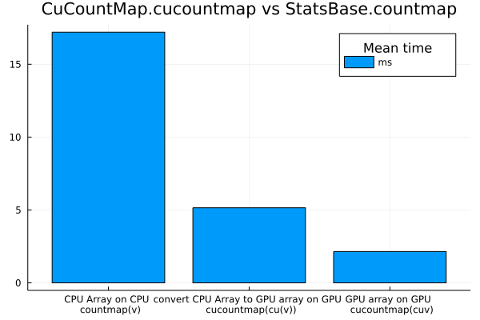

## CuCountmap

`cucountmap` is a faster `countmap` equivalent utilizing CUDA.jl  for `Vector{T}` where `isbits(T)` and `sizeof(T) <= 2`.

### Usage

```julia
using CuCountMap

v = rand(Int16, 1_000_000)

cucountmap(v) # converts v to cu(v) and then run countmap

using CUDA: cu

cuv = cu(v)
countmap(cuv) # StatsBase.countmap is overloaded for CuArrays
```

```
Dict{Int16, Int64} with 65536 entries:
  -23731 => 18
  29965  => 13
  30270  => 14
  1703   => 17
  7685   => 16
  -7029  => 16
  3406   => 12
  -30706 => 18
  28804  => 10
  27640  => 14
  -17985 => 18
  -28261 => 12
  -2851  => 19
  2015   => 12
  -25023 => 15
  31375  => 16
  -13631 => 15
  -8219  => 19
  28165  => 14
  ⋮      => ⋮
```


### Example & Benchmarks

```julia
using CUDA
using CuCountMap
using StatsBase: countmap

v = rand(Int16, 10_000_000);

using BenchmarkTools

cpu_to_gpu_benchmark = @benchmark gpu_countmap = cucountmap($v)
```

```
BenchmarkTools.Trial: 954 samples with 1 evaluation.
 Range (min … max):  4.374 ms … 13.528 ms  ┊ GC (min … max): 0.00% … 52.22%
 Time  (median):     4.814 ms              ┊ GC (median):    0.00%
 Time  (mean ± σ):   5.151 ms ±  1.145 ms  ┊ GC (mean ± σ):  3.24% ±  8.90%

   ██                                                         
  ▅██▇▇▇▆▅▄▄▄▄▃▃▃▃▃▂▂▂▂▁▂▂▂▁▁▁▂▁▁▁▁▁▁▁▁▁▁▁▁▁▁▁▁▁▁▁▁▁▁▁▂▂▂▂▂▂ ▃
  4.37 ms        Histogram: frequency by time        11.3 ms <

 Memory estimate: 2.38 MiB, allocs estimate: 103.
```


```julia
cpu_to_cpu_benchmark = @benchmark cpu_countmap = countmap($v)
```

```
BenchmarkTools.Trial: 291 samples with 1 evaluation.
 Range (min … max):  15.864 ms … 26.632 ms  ┊ GC (min … max): 0.00% … 18.12
%
 Time  (median):     16.843 ms              ┊ GC (median):    0.00%
 Time  (mean ± σ):   17.195 ms ±  1.444 ms  ┊ GC (mean ± σ):  1.72% ±  5.17
%

      ▃ ▅██▆▄▁                                                 
  ▃█▇▆████████▇▇▄▃▃▂▂▂▂▁▁▁▁▂▁▂▁▂▂▁▁▁▁▂▂▁▂▁▄▁▁▁▂▁▁▂▁▂▂▁▁▁▄▁▃▁▂ ▃
  15.9 ms         Histogram: frequency by time        22.6 ms <

 Memory estimate: 4.17 MiB, allocs estimate: 37.
```


```julia
cuv = CUDA.cu(v)
gpu_to_gpu_benchmark = @benchmark gpu_countmap2 = countmap(cuv)
```

```
BenchmarkTools.Trial: 2242 samples with 1 evaluation.
 Range (min … max):  1.799 ms …   9.377 ms  ┊ GC (min … max): 0.00% … 73.02
%
 Time  (median):     1.995 ms               ┊ GC (median):    0.00%
 Time  (mean ± σ):   2.150 ms ± 643.115 μs  ┊ GC (mean ± σ):  3.50% ±  8.43
%

   █▃                                                          
  ▄███▄▅▅▄▄▃▃▂▂▂▂▂▂▂▁▁▂▂▁▁▁▂▁▁▁▁▁▁▂▁▁▁▁▁▁▁▁▁▁▁▁▁▁▁▁▁▁▁▁▁▂▂▂▂▂ ▂
  1.8 ms          Histogram: frequency by time        5.82 ms <

 Memory estimate: 2.38 MiB, allocs estimate: 134.
```


#### Benchmark Plot

```julia
using Plots
using Statistics: mean

cpu_to_gpu = mean(cpu_to_gpu_benchmark.times)/1000/1000
gpu_to_gpu = mean(gpu_to_gpu_benchmark.times)/1000/1000
cpu_to_cpu = mean(cpu_to_cpu_benchmark.times)/1000/1000

plot(
["CPU Array on CPU \n countmap(v)", "convert CPU Array to GPU array on GPU \n cucountmap(cu(v))", "GPU array on GPU \n cucountmap(cuv)"],
[cpu_to_cpu, cpu_to_gpu, gpu_to_gpu],
seriestypes = :bar, title="CuCountMap.cucountmap vs StatsBase.countmap", label="ms",
legendtitle="Mean time")
```

```
[ Info: Precompiling Plots [91a5bcdd-55d7-5caf-9e0b-520d859cae80]
```



